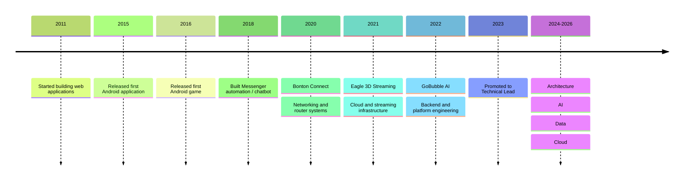

# Robin Mollah 😎

**Software Engineer · Technical Lead · Systems / Cloud / AI**

I build software where **scale, reliability, cost, latency, and unusual constraints actually matter**.

I've been building software since **2011**, working across software architecture, backend engineering, AI, data engineering, cloud infrastructure, DevOps, mobile development, and networking.

I primarily work with:

**Python · FastAPI · AWS · GCP · Kubernetes · Terraform · React · Flutter · Android · AI / Data Systems**

Some of the systems I've worked on include:

- ⚡ Ingesting **millions of social-media messages per hour**
- 🗄️ Processing and analyzing **terabytes of data**
- 🎥 Real-time **WebRTC streaming infrastructure**
- 🤖 AI, automation, and data-processing systems
- ☁️ Scalable infrastructure across AWS and GCP
- 📱 Android, Flutter, and React Native applications
- 📡 Customized Linux-based operating systems for Wi-Fi routers
- 🌐 Distributed networking systems running behind dynamic IPs

I enjoy problems involving **scale, difficult debugging, distributed systems, performance, cost optimization, and unfamiliar technology**.

> **Build it simply. Make it efficient. Understand how it actually works.**

---

## Experience

### GoBubble AI Tech Ltd

**Technical Lead**  
Dubai, UAE · **December 2023 – Present**

- Architecture and technical design
- Breaking product requirements into engineering work
- Backend and infrastructure development
- PR and architecture reviews
- Technical mentoring
- Risk management and documentation
- Production incident response
- Cross-team technical coordination

**Software Engineer**  
Remote · **June 2022 – November 2023**

Worked across backend, frontend, DevOps, infrastructure, and data systems using technologies including **Python, FastAPI, React, Angular, AWS, and GCP**.

---

### Eagle 3D Streaming

**DevOps Engineer**  
Texas, USA · Remote  
**March 2021 – May 2022**

Worked on infrastructure supporting real-time graphics and video streaming.

Areas included:

- AWS and GCP
- CI/CD
- Linux and Nginx
- Serverless workloads
- Cloud networking
- GPU / graphics-heavy infrastructure
- Cost optimization
- Network-sensitive production services

---

### Bonton Connect

**Software Engineer**  
Dhaka, Bangladesh

Worked on a platform for sharing unused Wi-Fi bandwidth.

My work included:

- Distributed networking systems
- Microservices
- React and React Native
- Native Android / Kotlin development
- Linux router customization
- Remote device control

---

## Career Timeline

---

## Core Stack

**Backend**  
Python · FastAPI · Django · Node.js

**Cloud & Infrastructure**  
AWS · GCP · Azure · Kubernetes · Docker · Terraform · Helm · ArgoCD

**Frontend & Mobile**  
React · Angular · Flutter · Android · Kotlin · React Native

**Data & AI**  
PostgreSQL · MongoDB · Pandas · Pub/Sub · SQS · LLM Systems · NLP · AI Automation

**Systems**  
Linux · Networking · Nginx · WebRTC · Shell

---

## Selected Engineering Interests

- Distributed systems
- AI systems and automation
- Large-scale data processing
- Cloud architecture
- Performance optimization
- Infrastructure cost optimization
- Networking and real-time systems
- Difficult production debugging

---

## Find me

🌐 [robin.engineer](https://robin.engineer)  
💻 [GitHub](https://github.com/robinmollah)  
💼 [LinkedIn](https://www.linkedin.com/in/robinmollah)  
🐦 [Twitter / X](https://twitter.com/robinsajin)  
✍️ [Medium](https://medium.com/@robinmollah)

> **Build it simply. Make it efficient. Understand how it actually works.**
