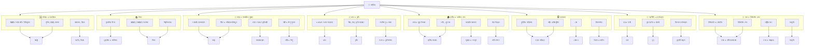

```mermaid
flowchart TB
    Citizen[🧍 নাগরিক]

    %% Identity & Justice
    subgraph ID[🆔 পরিচয় ও ন্যায়বিচার]
        NID[NID / পাসপোর্ট / ইমিগ্রেশন]
        Police[পুলিশ, GD, মামলা]
        Court[আদালত, বিচার]
    end
    NID --> Home[স্বরাষ্ট্র]
    Police --> Home
    Court --> Law[আইন, বিচার]

    %% Education
    subgraph EDU[📚 শিক্ষা]
        PrimaryEdu[প্রাথমিক শিক্ষা]
        SecondaryEdu[SSC / HSC / কলেজ]
        HigherEdu[বিশ্ববিদ্যালয়]
    end
    PrimaryEdu --> PrimaryMin[প্রাথমিক ও গণশিক্ষা]
    SecondaryEdu --> EduMin[শিক্ষা]
    HigherEdu --> EduMin

    %% Health & Social Safety
    subgraph HEALTH[🏥 স্বাস্থ্য ও সামাজিক সুরক্ষা]
        Hospital[সরকারি হাসপাতাল]
        Vaccine[টিকা ও পরিবার পরিকল্পনা]
        Allowance[ভাতা: বয়স্ক / প্রতিবন্ধী]
        WomenChild[নারী ও শিশু সুরক্ষা]
    end
    Hospital --> HealthMin[স্বাস্থ্য]
    Vaccine --> HealthMin
    Allowance --> SocialMin[সমাজকল্যাণ]
    WomenChild --> WomenMin[নারী ও শিশু]

    %% Food & Agriculture
    subgraph FOOD[🍚 খাদ্য ও কৃষি]
        OMS[ওএমএস / খাদ্য সহায়তা]
        Farming[বীজ, সার, কৃষি সহায়তা]
        Livestock[গবাদিপশু ও মৎস্য]
    end
    OMS --> FoodMin[খাদ্য]
    Farming --> AgriMin[কৃষি]
    Livestock --> FishMin[মৎস্য ও প্রাণিসম্পদ]

    %% Local & Utility Services
    subgraph LOCAL[🏠 স্থানীয় ও নাগরিক সেবা]
        Birth[জন্ম ও মৃত্যু নিবন্ধন]
        WaterSupply[পানি, ড্রেনেজ]
        Housing[সরকারি আবাসন]
        Flood[বন্যা নিয়ন্ত্রণ]
    end
    Birth --> LGRD[স্থানীয় সরকার]
    WaterSupply --> LGRD
    Housing --> HousingMin[গৃহায়ন ও গণপূর্ত]
    Flood --> WaterMin[পানি সম্পদ]

    %% Transport
    subgraph TRANS[🚍 যাতায়াত]
        License[ড্রাইভিং লাইসেন্স]
        Vehicle[গাড়ি রেজিস্ট্রেশন]
        Train[রেল]
        AirTravel[বিমানবন্দর]
    end
    License --> RoadMin[সড়ক পরিবহন]
    Vehicle --> RoadMin
    Train --> RailMin[রেলপথ]
    AirTravel --> AirMin[বিমান ও পর্যটন]

    %% Economy & Employment
    subgraph ECON[💼 অর্থনীতি ও কর্মসংস্থান]
        Tax[কর ও ভ্যাট]
        Jobs[শ্রম আইন ও চাকরি]
        Expat[বিদেশে কর্মসংস্থান]
    end
    Tax --> FinanceMin[অর্থ]
    Jobs --> LabourMin[শ্রম]
    Expat --> ExpatMin[প্রবাসী কল্যাণ]

    %% Info & Digital
    subgraph INFO[📡 তথ্য ও ডিজিটাল সেবা]
        Internet[ইন্টারনেট ও মোবাইল]
        Digital[ডিজিটাল সেবা]
        Media[রাষ্ট্রীয় তথ্য]
        Culture[সংস্কৃতি]
    end
    Internet --> ICTMin[ডাক ও টেলিযোগাযোগ]
    Digital --> ICTMin
    Media --> InfoMin[তথ্য ও সম্প্রচার]
    Culture --> CultureMin[সংস্কৃতি]

    Citizen --> ID
    Citizen --> EDU
    Citizen --> HEALTH
    Citizen --> FOOD
    Citizen --> LOCAL
    Citizen --> TRANS
    Citizen --> ECON
    Citizen --> INFO


```
